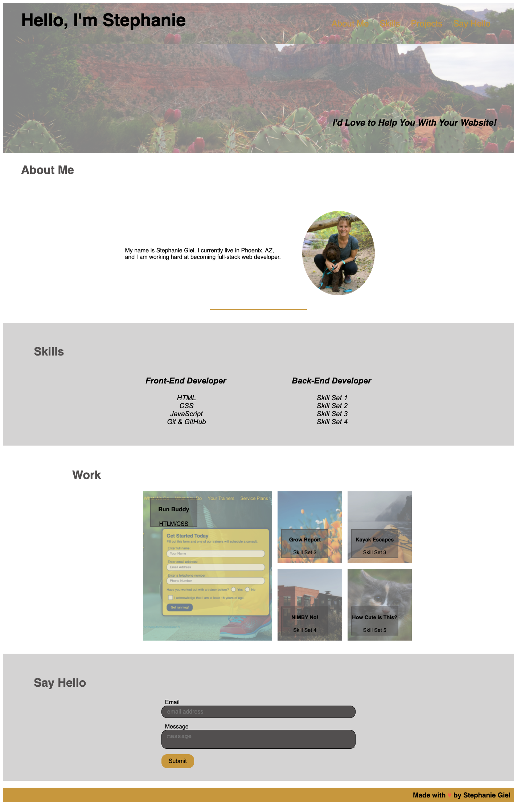

# Stephanie Personal Portfolio

## Description 

This was my creation of a web portfolio page meant to showcase my skills and talents to employers. It provides my name, a recent photo, links to sections about my skills and my work. Please note that there is currently only one link to a real project, the other 4 are placeholder projects that I made up. This page should also be enjoyable to view on many different screen sizes. 

This code contains skills I have recently learned including flexbox, CSS Grid Layout, media queries and CSS variables.

## Screenshot of webpage

## Link

[link to Horiseon webpage](https://sgiel.github.io/stephanie-portfolio/)